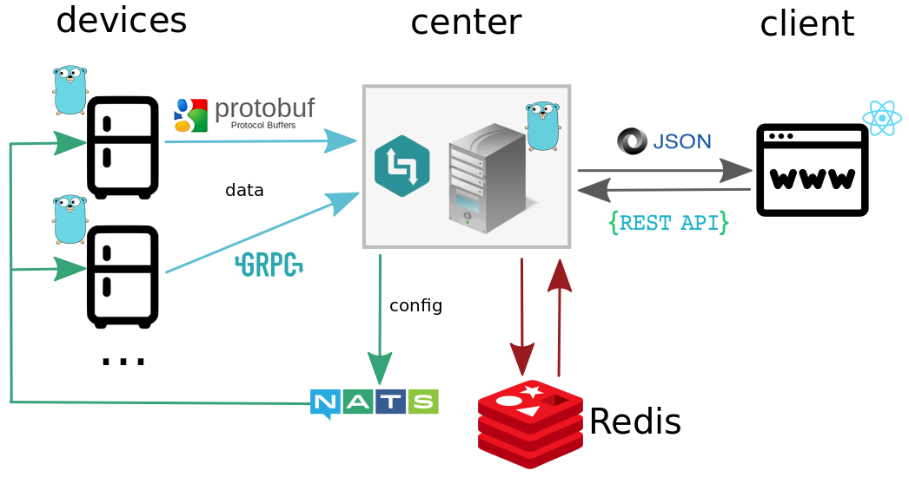

[](https://goreportcard.com/report/github.com/kostiamol/fridgems)
[](https://travis-ci.org/kostiamol/fridgems)

# fridgems
The project implements a device-side management automation for a home.

<p align="center"></p>

## Quickstart
1. Download and install the fridgems:

```bash
go get github.com/kostiamol/fridgems
```

2. Compile and run the fridgems:

```bash
cd $GOPATH/src/github.com/kostiamol/fridgems/cmd/fridgems
go build 
./fridgems -name=LG -mac=FF-FF-FF-FF-FF-FF
```
3. For proper functioning of the system as a whole, install and run the [centerms](https://github.com/kostiamol/centerms) and the [dashboard](https://github.com/kostiamol/dashboard-ui).
